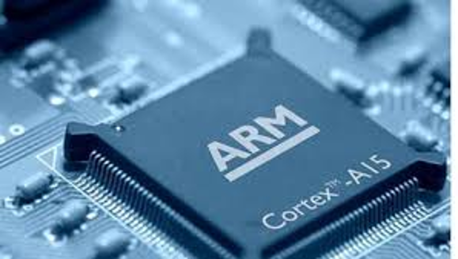
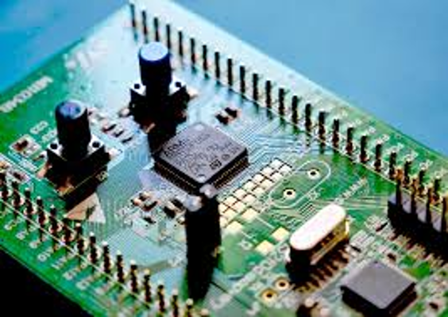
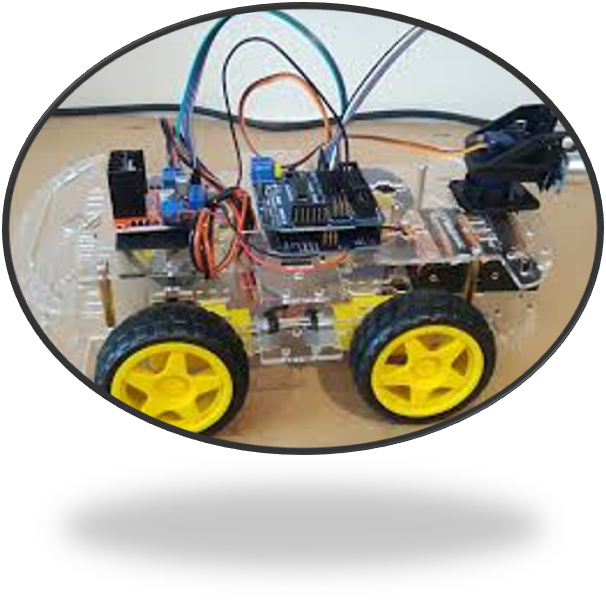
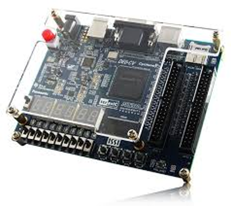

<!DOCTYPE html>
<html lang="en">
<head>
  <meta charset="UTF-8">
  <meta name="viewport" content="width=device-width, initial-scale=1.0">
  <title>Zyad Yasser Portfolio</title>
  
</head>
<body>
  <!-- Header -->
  <header>
    
    <h1>Zyad Yasser Mohamed</h1>
    
Electronics & Electrical Communication Engineer

    
Portfolio

  </header>

  <!-- Navigation -->
  <nav>
    <a href="#about">About</a>
    <a href="#education">Education</a>
    <a href="#skills">Skills</a>
    <a href="#projects">Projects</a>
    <a href="#achievements">Achievements</a>
    <a href="#contact">Contact</a>
  </nav>

  <!-- About Section -->
  <section id="about">
    <h2>About Me</h2>
    
I am an Electronics Engineering student with a strong interest in digital design, embedded systems, and FPGA development. I enjoy building practical projects that combine hardware and software. My goal is to apply engineering knowledge to solve real-world problems, while continuously improving my technical and research skills.

    <h3>Why Me?</h3>
    
You should choose me because I bring a combination of technical knowledge, hands-on project experience, and a passion for continuous learning. From designing processors on FPGA to working with Arduino applications, I have proven my ability to turn concepts into working solutions.

  </section>

  <!-- Education Section -->
  <section id="education">
    <h2>Education</h2>
    
<strong>Cairo University</strong> – Electronics & Electrical Communications (Aug 2023 – Jan 2028) GPA: 3.22

    
Training: Timmerman Industries, National Telecommunication Institute (NTI)

  </section>

  <!-- Skills Section -->
  <section id="skills">
    <h2>Skills & Expertise</h2>
    <ul>
      <li>Digital Design & FPGA (Verilog, Vivado, ModelSim)</li>
      <li>Embedded Systems & Arduino</li>
      <li>PCB Design</li>
      <li>Circuit Simulation & Debugging</li>
      <li>MATLAB for modeling & testing</li>
    </ul>
    
  </section>

  <!-- Projects Section -->
  <section id="projects">
    <h2>Previous Projects</h2>
    <ul>
      <li>Designed and implemented an 8-bit processor on FPGA using Verilog</li>
      <li>Developed an I2C master protocol for device communication</li>
      <li>Created PISO and SIPO converters for data transfer</li>
      <li>Designed a clock divider for accurate timing signals</li>
      <li>Built an Arduino-based smart car with sensors and obstacle avoidance</li>
    </ul>
    
    
  </section>

  <!-- Achievements Section -->
  <section id="achievements">
    <h2>Achievements</h2>
    <ul>
      <li>Successfully completed FPGA-based 8-bit processor design</li>
      <li>Developed working I2C communication protocol</li>
      <li>Arduino automation and robotics projects</li>
      <li>Hands-on training at NTI in FPGA and digital systems</li>
    </ul>
    
  </section>

  <!-- Contact Section -->
  <section id="contact" class="contact">
    <h2>Contact</h2>
    
Mokatam, Cairo

    
📞 +20 1551667933

    
📧 <a href="mailto:zeiad.ahmed04@eng-st.cu.edu.eg">zeiad.ahmed04@eng-st.cu.edu.eg</a>

  </section>
</body>
</html>
